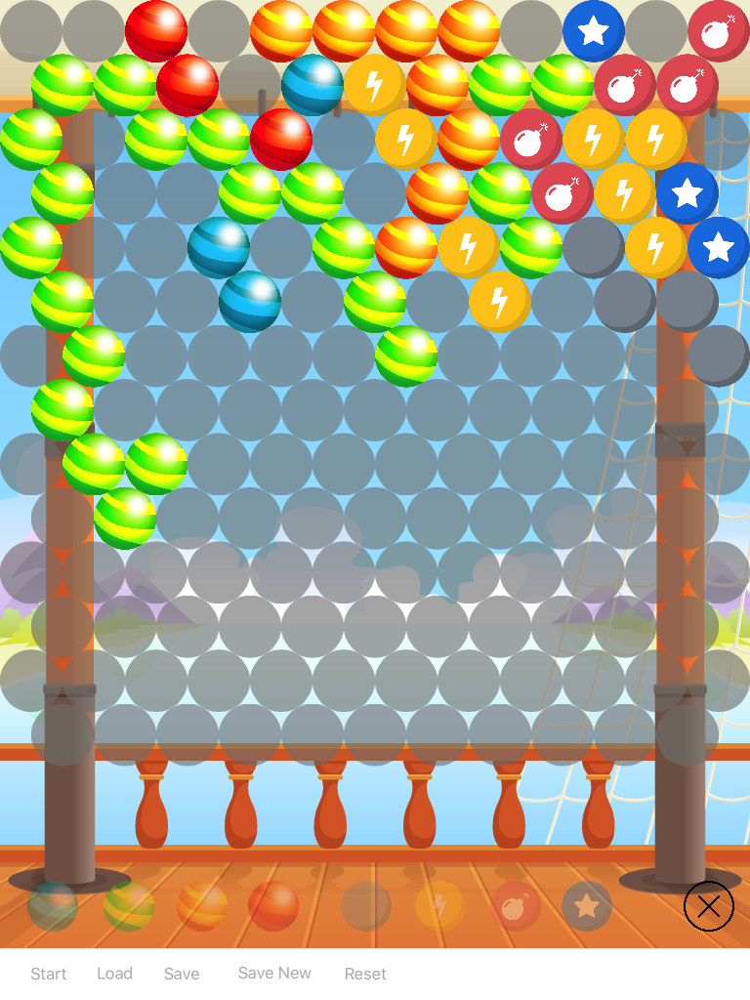
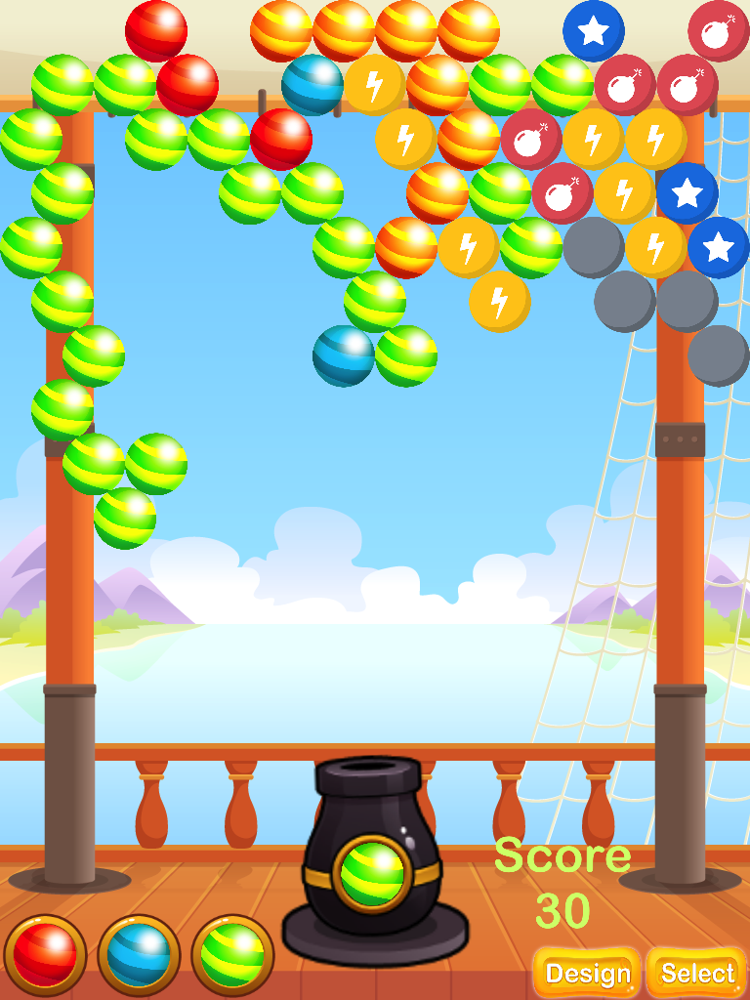
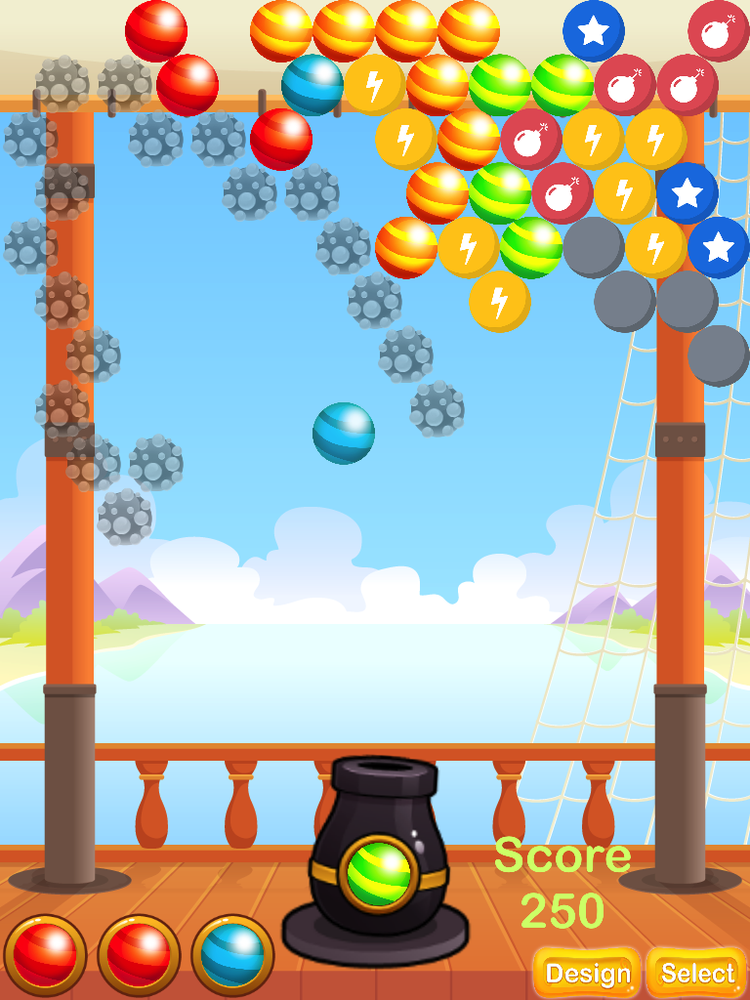
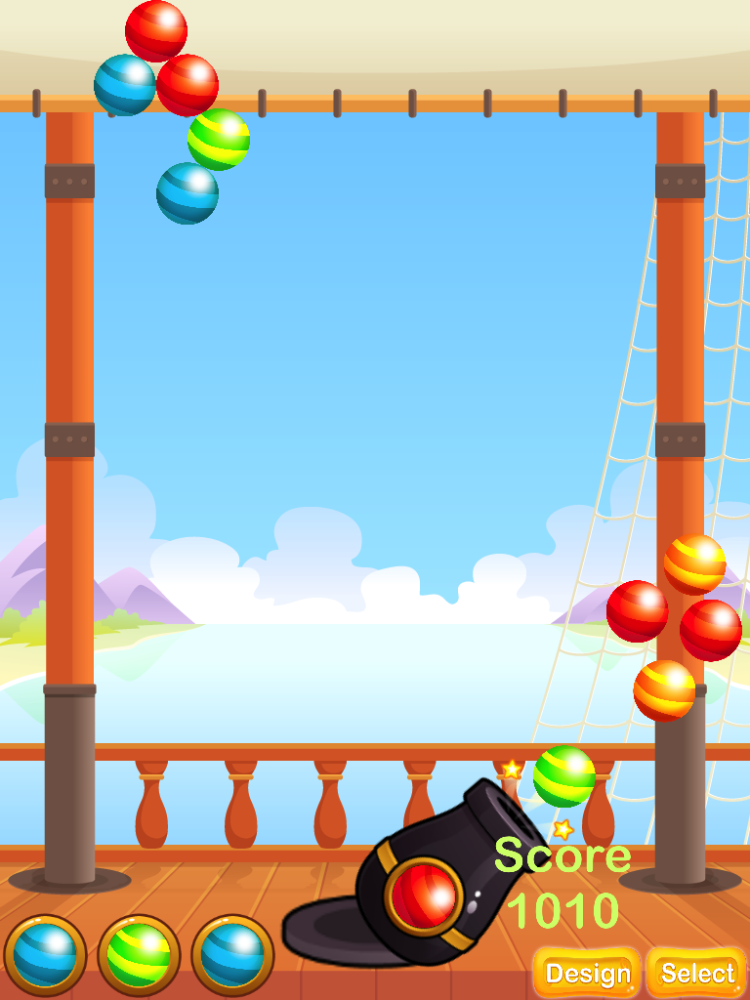

# Bubble Mania
    
    

## Rules 
Multiple projectile bubbles can be shot and collide in mid-air (elastic collision)

Lightning Bubble - Removes all bubbles in the same row as it. 
Bomb Bubble - Removes all bubbles adjacent to it. 
Star Bubble - When a coloured bubble comes into contact with the star bubble, all bubbles of that colour will be removed.

The effect of powerup bubbles that are directly activated/removed by other powerup bubbles will be triggered for a chain effect. 
Star bubbles triggered by this chain effect will trigger the removal of the initial snapped bubble's color type.

#### Game score
1. Removal of connected bubbles of the same type awards 10 points each 
2. Removal of special bubbles and bubbles removed by special bubbles (including chain effect) awards 20 points each 
3. Removal of floating bubbles awards 30 points each

If a destroyed bubble satisfies both 1 and 2 eg. a snapped blue bubble, a bomb bubble and a blue bubble are adjacent to each other, with the blue bubble connected to another blue bubble, the destroyed blue bubbles will be counted as 10 points each.

## Level designer
Design your own level; allows saving/loading.